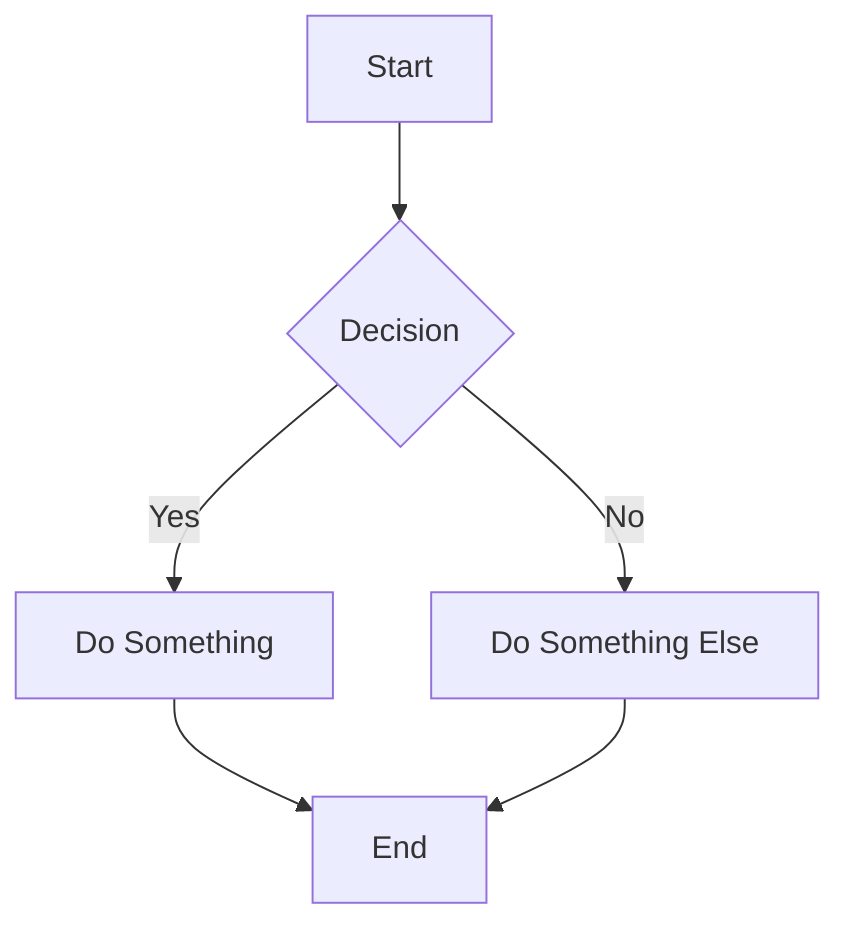

# Markdown Tutorial - Complete Guide with Examples

## Table of Contents
1. [Introduction](#introduction)
2. [Headings](#headings)
3. [Text Formatting](#text-formatting)
4. [Lists](#lists)
5. [Links](#links)
6. [Images](#images)
7. [Code](#code)
8. [Tables](#tables)
9. [Blockquotes](#blockquotes)
10. [Horizontal Rules](#horizontal-rules)
11. [Task Lists](#task-lists)
12. [Footnotes](#footnotes)
13. [Emojis](#emojis)
14. [Mathematical Expressions](#mathematical-expressions)
15. [Advanced Features](#advanced-features)

---

## Introduction

Markdown is a lightweight markup language that allows you to format plain text documents. It's widely used for documentation, README files, blogs, and note-taking.

**Key Benefits:**
- Easy to read and write
- Converts to HTML seamlessly
- Portable across platforms
- Version control friendly

---

## Headings

Markdown supports six levels of headings using the `#` symbol.

### Syntax:
```markdown
# Heading 1
## Heading 2
### Heading 3
#### Heading 4
##### Heading 5
###### Heading 6
```

### Output:
# Heading 1
## Heading 2
### Heading 3
#### Heading 4
##### Heading 5
###### Heading 6

**Alternative Syntax for H1 and H2:**
```markdown
Heading 1
=========

Heading 2
---------
```

---

## Text Formatting

### Bold Text

**Syntax:**
```markdown
**Bold text with asterisks**
__Bold text with underscores__
```

**Output:**
**Bold text with asterisks**
__Bold text with underscores__

### Italic Text

**Syntax:**
```markdown
*Italic text with asterisks*
_Italic text with underscores_
```

**Output:**
*Italic text with asterisks*
_Italic text with underscores_

### Bold and Italic

**Syntax:**
```markdown
***Bold and italic***
___Bold and italic___
**_Mixed bold and italic_**
```

**Output:**
***Bold and italic***
___Bold and italic___
**_Mixed bold and italic_**

### Strikethrough

**Syntax:**
```markdown
~~Strikethrough text~~
```

**Output:**
~~Strikethrough text~~

### Highlighting

**Syntax:**
```markdown
==Highlighted text==
```

**Output:**
==Highlighted text==

### Subscript and Superscript

**Syntax:**
```markdown
H~2~O (subscript)
X^2^ (superscript)
```

**Output:**
H~2~O
X^2^

---

## Lists

### Unordered Lists

**Syntax:**
```markdown
- Item 1
- Item 2
  - Nested item 2.1
  - Nested item 2.2
    - Deeply nested item
- Item 3

* Alternative with asterisk
+ Alternative with plus
```

**Output:**
- Item 1
- Item 2
  - Nested item 2.1
  - Nested item 2.2
    - Deeply nested item
- Item 3

### Ordered Lists

**Syntax:**
```markdown
1. First item
2. Second item
3. Third item
   1. Nested item 3.1
   2. Nested item 3.2
4. Fourth item
```

**Output:**
1. First item
2. Second item
3. Third item
   1. Nested item 3.1
   2. Nested item 3.2
4. Fourth item

### Mixed Lists

**Syntax:**
```markdown
1. First ordered item
2. Second ordered item
   - Unordered sub-item
   - Another sub-item
3. Third ordered item
```

**Output:**
1. First ordered item
2. Second ordered item
   - Unordered sub-item
   - Another sub-item
3. Third ordered item

---

## Links

### Inline Links

**Syntax:**
```markdown
[OpenAI](https://www.openai.com)
[Link with title](https://www.example.com "Example Website")
```

**Output:**
[OpenAI](https://www.openai.com)
[Link with title](https://www.example.com "Example Website")

### Reference Links

**Syntax:**
```markdown
[Reference link][1]
[Another reference][link-ref]

[1]: https://www.google.com
[link-ref]: https://www.github.com "GitHub"
```

**Output:**
[Reference link][1]
[Another reference][link-ref]

[1]: https://www.google.com
[link-ref]: https://www.github.com "GitHub"

### Automatic Links

**Syntax:**
```markdown
<https://www.example.com>
<email@example.com>
```

**Output:**
<https://www.example.com>
<email@example.com>

### Internal Links (Anchors)

**Syntax:**
```markdown
[Jump to Headings](#headings)
```

**Output:**
[Jump to Headings](#headings)

---

## Images

### Inline Images

**Syntax:**
```markdown


```

**Output:**


### Reference Images

**Syntax:**
```markdown
![Reference image][img1]

[img1]: https://via.placeholder.com/150 "Reference Placeholder"
```

**Output:**
![Reference image][img1]

[img1]: https://via.placeholder.com/150 "Reference Placeholder"

### Linked Images

**Syntax:**
```markdown
[](https://www.example.com)
```

**Output:**
[](https://www.example.com)

---

## Code

### Inline Code

**Syntax:**
```markdown
Use the `print()` function in Python.
Here's a variable: `let x = 10;`
```

**Output:**
Use the `print()` function in Python.
Here's a variable: `let x = 10;`

### Code Blocks (Fenced)

**Syntax:**
````markdown
```python
def hello_world():
    print("Hello, World!")
    return True
```

```javascript
function greet(name) {
    console.log(`Hello, ${name}!`);
}
```

```bash
ls -la
cd /home/user
```
````

**Output:**
```python
def hello_world():
    print("Hello, World!")
    return True
```

```javascript
function greet(name) {
    console.log(`Hello, ${name}!`);
}
```

```bash
ls -la
cd /home/user
```

### Code Blocks (Indented)

**Syntax:**
```markdown
    # Indent with 4 spaces
    def simple_function():
        return "indented code"
```

**Output:**

    # Indent with 4 spaces
    def simple_function():
        return "indented code"

### Syntax Highlighting

**Syntax:**
````markdown
```json
{
  "name": "John Doe",
  "age": 30,
  "city": "New York"
}
```

```sql
SELECT * FROM users WHERE age > 21;
```

```html
<div class="container">
    <h1>Hello World</h1>
</div>
```
````

**Output:**
```json
{
  "name": "John Doe",
  "age": 30,
  "city": "New York"
}
```

```sql
SELECT * FROM users WHERE age > 21;
```

```html
<div class="container">
    <h1>Hello World</h1>
</div>
```

---

## Tables

### Basic Tables

**Syntax:**
```markdown
| Header 1 | Header 2 | Header 3 |
|----------|----------|----------|
| Row 1    | Data     | Data     |
| Row 2    | Data     | Data     |
| Row 3    | Data     | Data     |
```

**Output:**
| Header 1 | Header 2 | Header 3 |
|----------|----------|----------|
| Row 1    | Data     | Data     |
| Row 2    | Data     | Data     |
| Row 3    | Data     | Data     |

### Aligned Tables

**Syntax:**
```markdown
| Left Aligned | Center Aligned | Right Aligned |
|:-------------|:--------------:|--------------:|
| Left         | Center         | Right         |
| Text         | Text           | Text          |
| Data         | Data           | Data          |
```

**Output:**
| Left Aligned | Center Aligned | Right Aligned |
|:-------------|:--------------:|--------------:|
| Left         | Center         | Right         |
| Text         | Text           | Text          |
| Data         | Data           | Data          |

### Tables with Formatting

**Syntax:**
```markdown
| Name | Description | Status |
|------|-------------|--------|
| **Bold Name** | *Italic desc* | ✅ Done |
| `Code` | Link: [Example](https://example.com) | ⏳ In Progress |
| ~~Cancelled~~ | Normal text | ❌ Cancelled |
```

**Output:**
| Name | Description | Status |
|------|-------------|--------|
| **Bold Name** | *Italic desc* | ✅ Done |
| `Code` | Link: [Example](https://example.com) | ⏳ In Progress |
| ~~Cancelled~~ | Normal text | ❌ Cancelled |

---

## Blockquotes

### Simple Blockquotes

**Syntax:**
```markdown
> This is a blockquote.
> It can span multiple lines.
```

**Output:**
> This is a blockquote.
> It can span multiple lines.

### Nested Blockquotes

**Syntax:**
```markdown
> First level quote
>> Second level quote
>>> Third level quote
```

**Output:**
> First level quote
>> Second level quote
>>> Third level quote

### Blockquotes with Other Elements

**Syntax:**
```markdown
> ### Heading in Blockquote
> 
> - List item 1
> - List item 2
>
> **Bold text** and *italic text*
>
> ```python
> print("Code in blockquote")
> ```
```

**Output:**
> ### Heading in Blockquote
> 
> - List item 1
> - List item 2
>
> **Bold text** and *italic text*
>
> ```python
> print("Code in blockquote")
> ```

---

## Horizontal Rules

**Syntax:**
```markdown
---
Three hyphens

***
Three asterisks

___
Three underscores
```

**Output:**
---
Three hyphens

***
Three asterisks

___
Three underscores

---

## Task Lists

**Syntax:**
```markdown
- [x] Completed task
- [x] Another completed task
- [ ] Incomplete task
- [ ] Another incomplete task
  - [x] Nested completed task
  - [ ] Nested incomplete task
```

**Output:**
- [x] Completed task
- [x] Another completed task
- [ ] Incomplete task
- [ ] Another incomplete task
  - [x] Nested completed task
  - [ ] Nested incomplete task

---

## Footnotes

**Syntax:**
```markdown
Here's a sentence with a footnote.[^1]

This is another footnote.[^note]

[^1]: This is the first footnote.
[^note]: This is a named footnote with more detail.
```

**Output:**
Here's a sentence with a footnote.[^1]

This is another footnote.[^note]

[^1]: This is the first footnote.
[^note]: This is a named footnote with more detail.

---

## Emojis

**Syntax:**
```markdown
:smile: :heart: :thumbsup: :rocket: :tada:
:fire: :star: :+1: :-1: :100:
```

**Output (GitHub Flavored Markdown):**
:smile: :heart: :thumbsup: :rocket: :tada:
:fire: :star: :+1: :-1: :100:

---

## Mathematical Expressions

### Inline Math

**Syntax:**
```markdown
Einstein's famous equation: $E = mc^2$
The quadratic formula: $x = \frac{-b \pm \sqrt{b^2-4ac}}{2a}$
```

**Output:**
Einstein's famous equation: $E = mc^2$
The quadratic formula: $x = \frac{-b \pm \sqrt{b^2-4ac}}{2a}$

### Block Math

**Syntax:**
```markdown
$$
\int_{-\infty}^{\infty} e^{-x^2} dx = \sqrt{\pi}
$$

$$
\sum_{i=1}^{n} i = \frac{n(n+1)}{2}
$$

$$
\begin{bmatrix}
a & b \\
c & d
\end{bmatrix}
$$
```

**Output:**
$$
\int_{-\infty}^{\infty} e^{-x^2} dx = \sqrt{\pi}
$$

$$
\sum_{i=1}^{n} i = \frac{n(n+1)}{2}
$$

$$
\begin{bmatrix}
a & b \\
c & d
\end{bmatrix}
$$

---

## Advanced Features

### Definition Lists

**Syntax:**
```markdown
Term 1
: Definition 1

Term 2
: Definition 2a
: Definition 2b
```

**Output:**
Term 1
: Definition 1

Term 2
: Definition 2a
: Definition 2b

### Escaping Characters

**Syntax:**
```markdown
\* Not italic \*
\# Not a heading
\[Not a link\]
\`Not code\`
```

**Output:**
\* Not italic \*
\# Not a heading
\[Not a link\]
\`Not code\`

### HTML in Markdown

**Syntax:**
```markdown
<div style="color: blue; font-weight: bold;">
  This is HTML content in Markdown
</div>

<details>
<summary>Click to expand</summary>

Hidden content here!

- List item
- Another item

</details>
```

**Output:**
<div style="color: blue; font-weight: bold;">
  This is HTML content in Markdown
</div>

<details>
<summary>Click to expand</summary>

Hidden content here!

- List item
- Another item

</details>

### Comments

**Syntax:**
```markdown
[//]: # (This is a comment and won't be visible)
[//]: # "This is also a comment"

<!-- HTML-style comment -->
```

### Line Breaks

**Syntax:**
```markdown
Line 1  
Line 2 (two spaces after Line 1)

Line 1\
Line 2 (backslash after Line 1)

Line 1<br>
Line 2 (HTML br tag)
```

**Output:**
Line 1  
Line 2 (two spaces after Line 1)

Line 1\
Line 2 (backslash after Line 1)

Line 1<br>
Line 2 (HTML br tag)

### Diagrams (Mermaid)

**Syntax:**
````markdown

````

**Output:**


### Alerts/Admonitions

**Syntax:**
```markdown
> [!NOTE]
> Useful information that users should know.

> [!TIP]
> Helpful advice for doing things better.

> [!IMPORTANT]
> Key information users need to know.

> [!WARNING]
> Urgent info that needs immediate attention.

> [!CAUTION]
> Advises about risks or negative outcomes.
```

**Output:**
> [!NOTE]
> Useful information that users should know.

> [!TIP]
> Helpful advice for doing things better.

> [!IMPORTANT]
> Key information users need to know.

> [!WARNING]
> Urgent info that needs immediate attention.

> [!CAUTION]
> Advises about risks or negative outcomes.

---

## Quick Reference Cheat Sheet

| Element | Syntax |
|---------|--------|
| Heading | `# H1` through `###### H6` |
| Bold | `**text**` or `__text__` |
| Italic | `*text*` or `_text_` |
| Strikethrough | `~~text~~` |
| Code | `` `code` `` |
| Link | `[title](url)` |
| Image | `` |
| Unordered List | `- item` or `* item` |
| Ordered List | `1. item` |
| Blockquote | `> quote` |
| Horizontal Rule | `---` or `***` |
| Table | `\| Header \| Header \|` |
| Task List | `- [ ] task` |
| Footnote | `[^1]` |
| Inline Math | `$equation$` |
| Block Math | `$$equation$$` |

---

## Tips and Best Practices

1. **Consistency**: Choose one style (e.g., `*` or `_` for emphasis) and stick with it
2. **Spacing**: Add blank lines between different elements for better readability
3. **Preview**: Always preview your markdown to ensure it renders correctly
4. **Portability**: Different platforms may support different features (GitHub, GitLab, etc.)
5. **Documentation**: Use descriptive alt text for images and links
6. **Version Control**: Markdown works great with Git - keep lines short for better diffs
7. **Accessibility**: Use semantic headings in order (don't skip levels)

---

## Common Markdown Flavors

- **GitHub Flavored Markdown (GFM)**: Tables, task lists, strikethrough, auto-linking
- **CommonMark**: Standardized core specification
- **Markdown Extra**: Definition lists, footnotes, abbreviations
- **MultiMarkdown**: Metadata, cross-references, math
- **Pandoc Markdown**: Extended features for document conversion

---

## Conclusion

Markdown is a powerful yet simple formatting language that makes writing documentation enjoyable and efficient. This tutorial covers most common features you'll need. Practice with different elements to become proficient!

### Additional Resources

- [Official Markdown Guide](https://www.markdownguide.org/)
- [CommonMark Specification](https://commonmark.org/)
- [GitHub Flavored Markdown](https://github.github.com/gfm/)
- [Markdown Cheat Sheet](https://www.markdownguide.org/cheat-sheet/)

---

**Happy Markdown Writing! 🚀📝**
